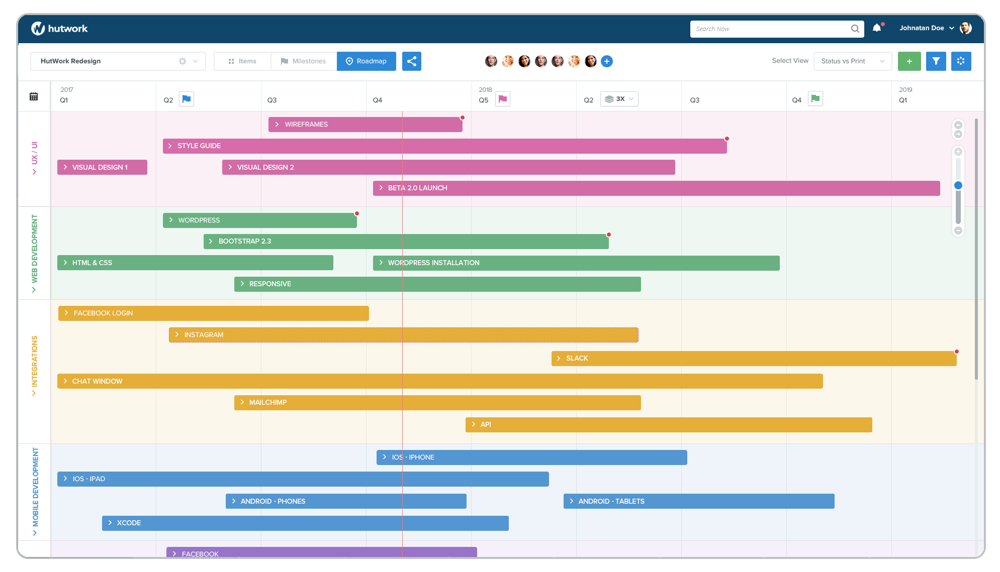

> 
# Abstract
This document created for create algorithm of creating a software project.This document consist only my opinions and it may be change on a different situation.You can change flowchart by import diagram.drawio file to draw.io.  
This documentation contains excerpts from <a href="https://www.altexsoft.com/blog/business/technical-documentation-in-software-development-types-best-practices-and-tools/">this page</a>
# Table of Contents
- [Which Problem Will You Solve?](#Which&nbsp;Problem&nbsp;Will&nbsp;You&nbsp;Solve?)
- [Specify Possible Problems](#Specify&nbsp;Possible&nbsp;Problems)
- [Cut Problems to Small Pieces](#Cut&nbsp;Problems&nbsp;to&nbsp;Small&nbsp;Pieces)
- [MVP Specification](#MVP&nbsp;Specification)
- [LVP Specification](#LVP&nbsp;Specification)
- [Tech Stack](#Tech&nbsp;Stack)
- [Plan Objects](#Plan&nbsp;Objects)
- [Plan Database](#Plan&nbsp;Database)
- [Create Database Diagrams](#Create&nbsp;Database&nbsp;Diagrams)
- [API Documentation](#API&nbsp;Documentation)
- [Topology](#Topology)
- [User Stereotypes](#User&nbsp;Stereotypes)
- [User Scenerios](#User&nbsp;Scenerios)
- [User Storymaps](#User&nbsp;Storymaps)
- [Menu Map](#Menu&nbsp;Map)
- [Wireframe](#Wireframe)
- [Standarts,Methods,Directories,Structures,Scaffolding,Protocols](#Standarts,Methods,Directories,Structures,Scaffolding,Protocols)
- [Alghorithms and Flowcharts](#Alghorithms&nbsp;and&nbsp;Flowcharts)
- [Create Task](#Create&nbsp;Task)
- [Roadmap and Planning](#Roadmap&nbsp;and&nbsp;Planning)
- [Coding](#Coding)
- [Release](#Release)
- [Prepare for New Release](#Prepare&nbsp;for&nbsp;New&nbsp;Release)
- [Start Agile Development](#Start&nbsp;Agile&nbsp;Development)
## Which&nbsp;Problem&nbsp;Will&nbsp;You&nbsp;Solve?
Describe the problem and specify possible solutions.Why you will make this software and which problems this software will solve.
> Live trading from internet.People need to trade faster and this software is going to solve very fast trading problem.
## Specify&nbsp;Possible&nbsp;Problems
Problems you anticipate. It can be about technical or non-technical.
> - How to handle live data on software ?
## Cut&nbsp;Problems&nbsp;to&nbsp;Small&nbsp;Pieces
Cut Problems into smaller problems.
> - How to generate live data ? 
> - How to display live data on browser ?
## MVP&nbsp;Specification
Create Most Valuable Pieces of Software.This features must be in first release on software.Also it means the smallest sellable piece of software.You can specify features.
> - Login
> - Manage profile
> - Live Trading
## LVP&nbsp;Specification
Create Less Valuable Pieces.You can add this features after first release and every feature should increase value of software.
> - Trade With Bots
> - Trading with AI
> - Responsive UI
## Tech&nbsp;Stack
You should specify technologies with versions that you will use on project.
> - Redis=5.0
> - Dotnet Core=5.0
> - Docker=18.3
> - Ubuntu=18.04
## Plan&nbsp;Objects
Create objects you will use on software.
> type User struct {
> 	Id       int    `json:"user_id"`
> 	Username string `json:"username"`
> 	Password string `json:"password"`
> 	Role     string `json:"role"`
> }
## Plan&nbsp;Database
Plan database server and all kind of specification about database.
> Mongo for logging.120 Gi disk size i need.I wille be delete collections older than 3 months every day.
## Create&nbsp;Database&nbsp;Diagrams
You can draw E.R diagram or database diagrams based on objects.
> 
> 
## API&nbsp;Documentation
Create API documenatation(Postman Recommended).It must be contain models that will be used.
> 
## Topology
Draw a topology that includes all kind of components.
> 
## User&nbsp;Stereotypes
Specify all kind of user stereotypes.This can be defined system user or client user.
> - Admin: capable of manage system
> - Editor: Can edit pages
> - User: Do not have knowledge about IT
## User&nbsp;Scenerios
It includes what users can do.Also indicates which features can be use by user on new releases
> 
## User&nbsp;Storymaps
It consist all kind of user operations on the UI.You can draw a flowchart for all kind of components(buttons,inputs,navigations) that user will be use
> 
## Menu&nbsp;Map
It is for planning menus that all kind of users navigation on the ui.A separate flow chart can be drawn for each user.
> 
## Wireframe
You can sketch all of the UI screens.
> 
## Standarts,Methods,Directories,Structures,Scaffolding,Protocols
Plan all of the rest plannings like specify protocols,functions,system requirements etc.
> - Protocol: gRPC
> - Methods: getUsers(),deleteUser()
> - Directory structure: - --models ---models.go --frontend ---src ----index.js --database --main.go
## Alghorithms&nbsp;and&nbsp;Flowcharts
All kind of algorithms and flowcharts.
## Create&nbsp;Task
Create all of the task for planning development
> - Creating Database Relations
> - Creating Sign Up Page
> - Setup Test Cluster
## Roadmap&nbsp;and&nbsp;Planning
Planning all of the development project
> 
> 
> 
## Coding
Start development process.Plan testing , CI/CD , clustering , backups , monitoring etc.
## Release
Release the version.
## Prepare&nbsp;for&nbsp;New&nbsp;Release
Preparing for new version of software.
## Start&nbsp;Agile&nbsp;Development
If planned releases have been done , start agile development.You can take feature requests or develop extra sections or fix bugs.